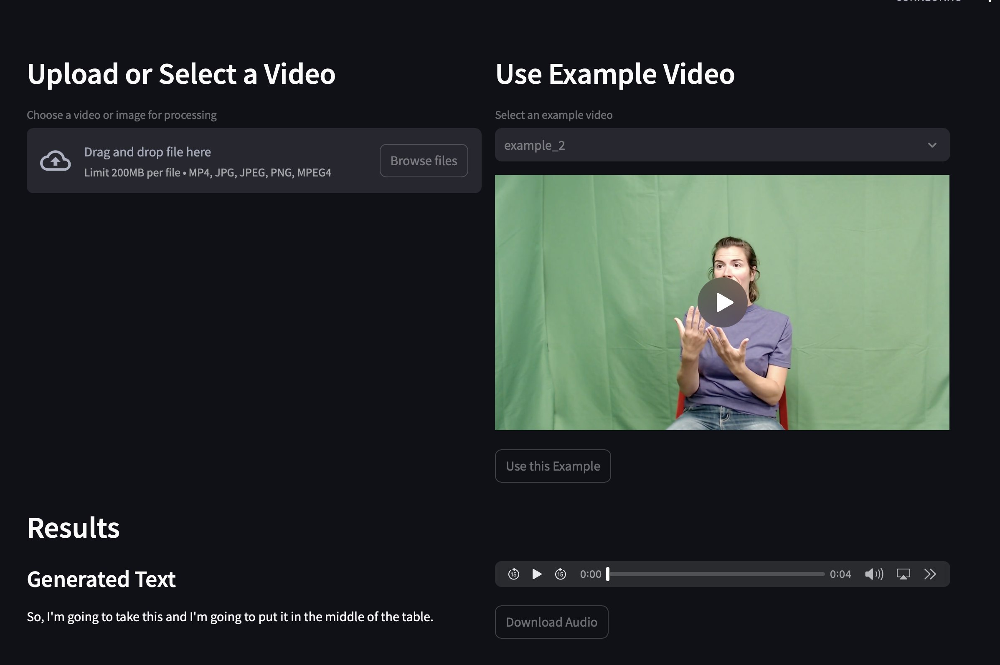

# Sign Language to Speech (SLTTS)

This project converts sign language videos into speech using computer vision and text-to-speech (TTS) technologies.

## 🚀 Features

- Sign language recognition using neural networks
- Text generation from recognized gestures
- Speech synthesis using TTS

## 🛠️ Installation

1. Clone the repository:

   ```bash
   git clone https://github.com/MaxBushuev/sign_language_tts.git
   cd sign_language_tts
   ```

2. Make sure you have Python 3.9+ installed and install the dependencies:

   ```bash
   pip install -r req.txt
   ```

3. Train model:

   ```bash
   python train/expreiments/train.py
   ```

## 🧑‍💻 Usage

1. Run the main script:

   ```bash
   streamlit run serve/app.py
   ```

2. The program will process the video, recognize the gestures, and convert them to speech.

## 📦 Project Structure

```
sign_language_tts/
├── checkpoints/            # Model checkpoints for inference
├── examples/               # Example images and test videos
│   ├── example_ui.png      # Screenshot of the application interface
│   └── *.mp4, *.jpg        # Example videos and images for testing
├── serve/                  # Serving-related scripts
├── static/                 # Static files for UI
├── train/experiments/      # Experiment files for training
├── .gitignore              # Git ignore file
├── Dockerfile              # Docker configuration
├── README.md               # This file
├── req.txt                 # Additional requirements
├── requirements.txt        # Main dependencies
└── test.py                 # Test script
```

## 🖼️ Example

Here is an example of the application interface:


## 🛡️ License

This project is licensed under the MIT License. See the LICENSE file for details.

## 🤝 Authors

- Max Bushuev - Conducted research on sign-to-text solutions, adapted State-of-the-Art models for the task, integrated an LLM, and developed scripts for training and inference
- Khlyustov Ilya - Developed and optimized model training pipelines, implemented performance improvements, and assisted in debugging training issues
- Anna Schenikova - Conducted minor research on TTS and sign-to-text solutions, improved and fixed the Web UI with examples, managed repository documentation on Git, and set up large model training using Max's code
- Arina Gertel - Developed the inference pipeline and created the Web UI for the project
- Sofia Cherepennikova - Implemented data preprocessing pipelines, conducted model evaluation, and assisted in hyperparameter tuning
- Kate Burmistrova - Conducted research on State-of-the-Art Text-to-Speech solutions and developed the TTS MVP

If you have any questions or suggestions, feel free to create an issue or submit a pull request.

---

Enjoy using SLTTS! 😊

